# stoics-quotes-quiz-questions-rest-api

### Goal

1. Create REST API application which has Quizzes available to the client.
2. Learn: Java, Spring Boot 3

### Disclaimer

Application does not contain real quotes. It shows only mechanism. And it is part of my learning process.

### URLs

#### GET

```
http://localhost:8080/quizzes
```

```
http://localhost:8080/quizzes/Quiz1
```

```
http://localhost:8080/quizzes/Quiz1/quotes
```

```
http://localhost:8080/quizzes/Quiz1/quotes/Quote1
```

#### Response

```
[
    {
        "id": "Quiz1",
        "title": "Stoics' Quotes Quiz",
        "description": "Quiz contains 4 quotes. Each quote is also a question. There are four Stoics: Marcus Aurelius, Epictetus, Seneca, and Zeno. Only one man is an author of specific quote.",
        "quotes": [
            {
                "id": "Quote1",
                "quote": "Quote of Marcus Aurelius",
                "options": [
                    "Marcus Aurelius",
                    "Epictetus",
                    "Seneca",
                    "Zeno"
                ],
                "correctAnswer": "Marcus Aurelius"
            },
            {
                "id": "Quote2",
                "quote": "Quote of Epictetus",
                "options": [
                    "Marcus Aurelius",
                    "Epictetus",
                    "Seneca",
                    "Zeno"
                ],
                "correctAnswer": "Epictetus"
            },
            {
                "id": "Quote3",
                "quote": "Quote of Seneca",
                "options": [
                    "Marcus Aurelius",
                    "Epictetus",
                    "Seneca",
                    "Zeno"
                ],
                "correctAnswer": "Seneca"
            },
            {
                "id": "Quote4",
                "quote": "Quote of Zeno",
                "options": [
                    "Marcus Aurelius",
                    "Epictetus",
                    "Seneca",
                    "Zeno"
                ],
                "correctAnswer": "Zeno"
            }
        ]
    }
]
```

### Request Body

Tested
with: [Talend API Tester](https://chrome.google.com/webstore/detail/talend-api-tester-free-ed/aejoelaoggembcahagimdiliamlcdmfm)
available for Chrome.

```
{
    "id": "id",
    "quote": "Your favourite quote",
    "options": [
        "Marcus Aurelius",
        "Epictetus",
        "Seneca",
        "Zeno"
    ],
    "correctAnswer": "Zeno"
}
```

### Screenshots

- Quizzes

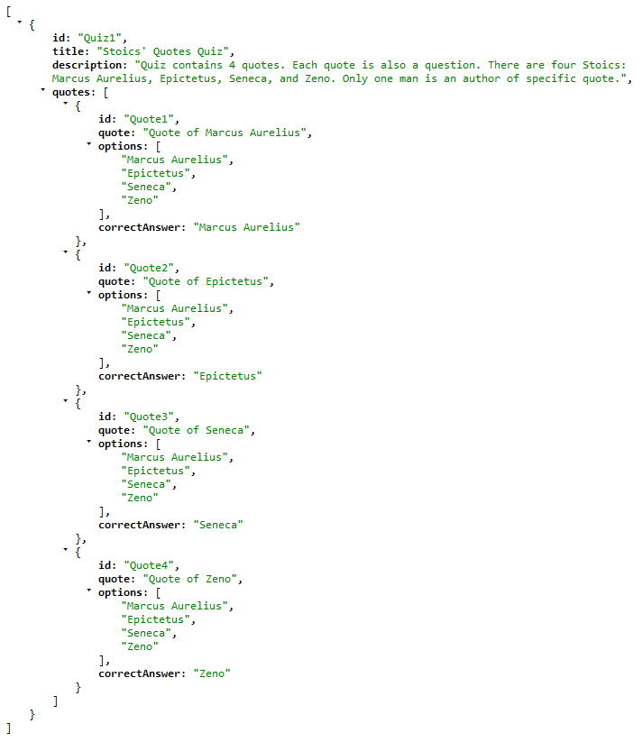

- GET Quote1

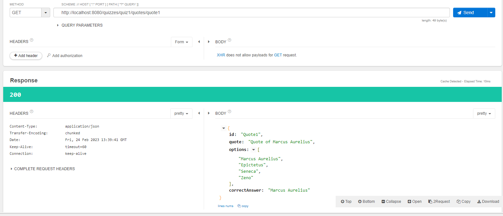

- POST status=201 (CREATED)

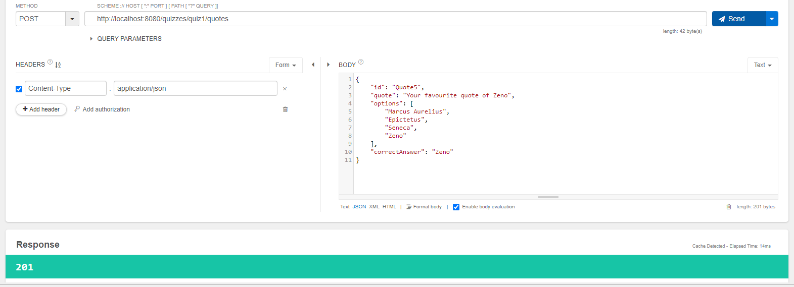

- Header Location

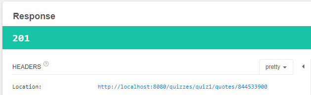

- DELETE status=204 (NO CONTENT)

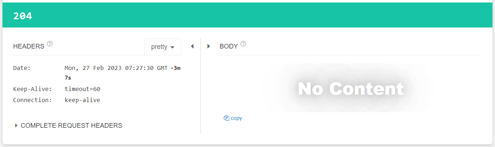

- PUT Quote2

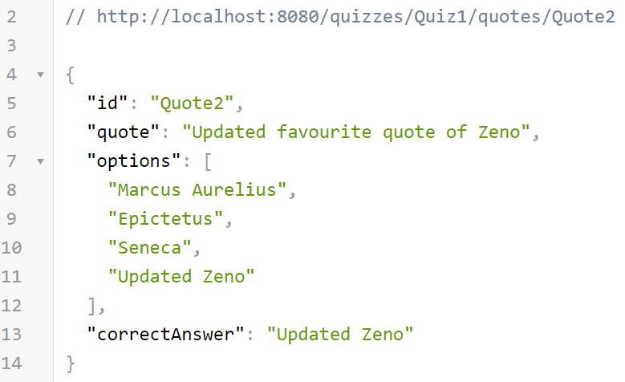

- Integration Tests GET and POST
 
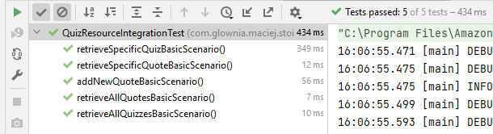

- Unit Tests (Mock) GET and POST
 
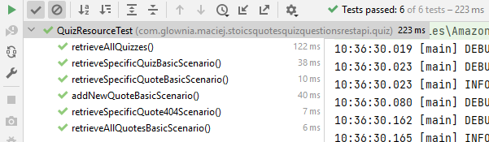

- Spring Security

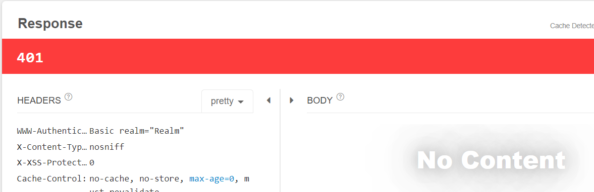

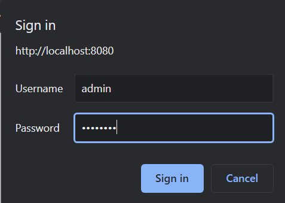

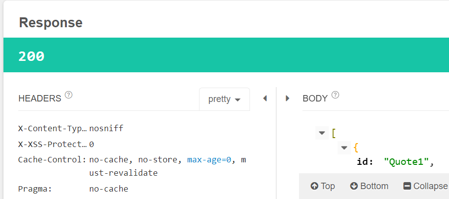

- Spring Security Testing

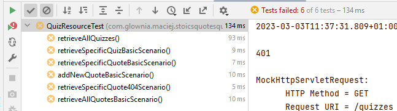

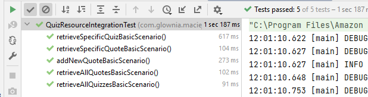

### Dear Visitor

If you see an opportunity to improve my code do not hesitate to contact me:
maciej.k.glownia@gmail.com. If you want to copy it and develop with your own idea, take it and enjoy
your learning path.
